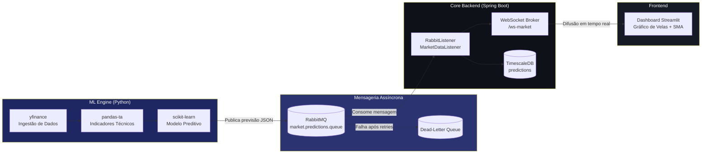

# 📈 TrendPulse AI

### Plataforma reativa de análise preditiva de mercados financeiros, orientada a eventos e alimentada por Machine Learning

TrendPulse AI combina um pipeline de Machine Learning em Python com um backend orientado a eventos em Java/Spring Boot para transformar dados de mercado em previsões acionáveis, entregues em tempo real através de WebSockets. O projeto foi desenhado como demonstração prática de arquitetura distribuída, mensageria assíncrona e orquestração de sistemas de IA em produção.

---

## 🏗️ Arquitetura do Sistema

O sistema está dividido em três componentes independentes, comunicando de forma assíncrona e desacoplada:

- **ML Engine & Ingestão de Dados (Python):** responsável por obter dados históricos e em tempo real via `yfinance`, calcular indicadores técnicos com `pandas-ta` (ex: Médias Móveis Simples), e gerar previsões através de modelos `scikit-learn`. Após o processamento, publica os resultados numa fila RabbitMQ.
- **Core Backend (Java / Spring Boot):** consome as previsões da fila RabbitMQ através de um `@RabbitListener`, persiste-as em TimescaleDB para histórico permanente, e distribui-as instantaneamente a todos os clientes ligados via WebSocket (STOMP sobre SockJS), garantindo baixa latência e comunicação bidirecional.
- **Dashboard (Python / Streamlit):** interface visual "dark mode" que apresenta gráficos de velas interativos (Plotly), médias móveis e métricas de previsão, pensada para um contexto de trading.

Esta separação de responsabilidades permite escalar cada componente de forma independente — por exemplo, múltiplas instâncias do ML Engine podem publicar previsões para a mesma fila, enquanto o Core Backend distribui essa informação a milhares de clientes WebSocket sem acoplamento direto entre os serviços.

### Fluxo Event-Driven



---

## 🛠️ Tecnologias Utilizadas

| Camada | Tecnologia | Finalidade |
|---|---|---|
| Core Backend | Java 17, Spring Boot 3 | Orquestração, WebSockets, integração AMQP |
| Mensageria | RabbitMQ (Spring AMQP) | Comunicação assíncrona entre serviços |
| Comunicação Real-Time | WebSocket (STOMP/SockJS) | Difusão de previsões em baixa latência |
| Persistência | PostgreSQL + TimescaleDB, Spring Data JPA | Histórico de previsões particionado por tempo |
| ML Engine | Python 3.11, scikit-learn | Modelação preditiva de séries temporais |
| Dados de Mercado | yfinance | Ingestão de dados históricos e em tempo real |
| Indicadores Técnicos | pandas-ta | Cálculo de SMA, RSI e outros indicadores |
| Frontend | Streamlit, Plotly | Dashboard interativo em dark mode |
| Observabilidade | Spring Boot Actuator | Health checks (RabbitMQ + DB), métricas |
| Resiliência | RabbitMQ DLQ, retry com backoff (Java + Python) | Tolerância a falhas transitórias |
| Testes | JUnit 5, Mockito, pytest | Testes unitários backend e ml-engine |
| Build/Dependências | Maven, pip | Gestão de dependências dos módulos |

---


## 🗺️ Roadmap de Desenvolvimento

**Fase 1 — Fundações (atual)**
- [x] Estrutura de monorepo
- [x] Configuração base do Spring Boot (WebSocket + RabbitMQ)
- [x] Script inicial de ingestão e visualização de dados

**Fase 2 — Inteligência Preditiva**
- [x] Publicação real das previsões via `pika` para o RabbitMQ
- [x] Pipeline de feature engineering (retornos, SMA ratios, RSI, volatilidade, volume relativo)
- [x] Treino e serialização de um modelo scikit-learn (`RandomForestRegressor`) para prever o retorno do dia seguinte

**Fase 3 — Tempo Real e Escala**
- [x] Cliente WebSocket embutido no dashboard (STOMP/SockJS), atualização sem rerun/polling
- [x] Persistência histórica de previsões (PostgreSQL / TimescaleDB)
- [ ] Consumo de dados de mercado em streaming (near real-time)
- [ ] Autenticação e gestão de múltiplos utilizadores no dashboard

**Fase 4 — Produção**
- [x] Containerização completa (Docker Compose: RabbitMQ + TimescaleDB + Core Backend + ML Engine + Dashboard)
- [x] Testes automatizados (JUnit/Mockito no backend, pytest no ml-engine)
- [x] Observabilidade e resiliência (Actuator, Dead-Letter Queue, retry com backoff, healthchecks)
- [ ] CI/CD (GitHub Actions)

**Fase 5 — Accuracy, API e UX**
- [x] Job diário de avaliação de accuracy (`AccuracyEvaluationService`), comparando `predictedPrice` com o preço real observado
- [x] API versionada (`/api/v1/...`) com paginação real (`Page<T>` do Spring Data)
- [x] Gráfico "previsto vs. real" e métricas de accuracy no dashboard
- [x] Grid comparativo multi-ativo, gauge de confiança e anotação de previsão no candlestick
- [x] TTL de cache adaptado ao período pedido, limpeza explícita do WebSocket ao trocar de ativo

---

## 🧠 Modelo Preditivo (scikit-learn)

O `ml-engine` treina um `RandomForestRegressor` para prever o **retorno percentual do dia seguinte**, usando features relativas (retornos, rácios face a médias móveis, RSI, volatilidade, volume relativo) — desenhadas para generalizar entre ativos com escalas de preço muito diferentes (ex: AAPL vs. BTC-USD).

```bash
cd ml-engine
pip install -r requirements.txt
python train_model.py                              # treina com os 5 ativos por defeito
python train_model.py --tickers AAPL MSFT --period 1y   # personalizado
```

O artefacto treinado é guardado em `ml-engine/models/price_predictor.joblib`. O dashboard deteta automaticamente a presença deste ficheiro:

- **Modelo presente** → usa a previsão real do `RandomForestRegressor` (badge verde "🤖 Previsão gerada pelo modelo")
- **Modelo ausente** → cai automaticamente no fallback heurístico de cruzamento SMA 20/50 (badge amarelo de aviso), para que o dashboard nunca fique bloqueado

A confiança apresentada não é um valor fixo: é derivada da **variância entre as árvores da floresta** — se todas as árvores concordarem na previsão, a confiança sobe; se discordarem muito, desce. Isto dá um sinal de incerteza genuíno, em vez de um número arbitrário.

## 🗄️ Persistência (PostgreSQL / TimescaleDB)

Cada previsão consumida da fila RabbitMQ é agora gravada de forma permanente, antes de ser difundida via WebSocket. Isto resolve uma lacuna importante das fases anteriores: sem persistência, não havia forma de responder a "o que é que o modelo previu para a AAPL na semana passada?" — a informação existia só durante a difusão em tempo real.

**Porquê TimescaleDB (e não PostgreSQL simples)?** TimescaleDB é uma extensão do PostgreSQL especializada em séries temporais — converte a tabela `predictions` numa *hypertable*, particionada automaticamente pela coluna `generated_at`. Isto mantém as queries rápidas mesmo quando a tabela cresce para milhões de linhas (ex: "previsões dos últimos 7 dias" tira partido do particionamento em vez de fazer table scan completo). Como é 100% compatível com o protocolo PostgreSQL, o driver JDBC e o Spring Data JPA usados são exatamente os mesmos de um Postgres normal.

- `PredictionEntity` — entidade JPA persistida (`core-backend/.../model/PredictionEntity.java`), com campos `actualPrice`/`actualReturn` já preparados (mas por preencher) para uma futura Fase de cálculo de accuracy histórica do modelo.
- `TimescaleDbInitializer` — ativa a extensão `timescaledb` e converte `predictions` em hypertable no arranque da aplicação (o Hibernate sabe criar tabelas relacionais, mas não tem noção de extensões específicas do Postgres).
- `PredictionHistoryController` — expõe (todos sob `/api/v1/predictions`, ver "API e Accuracy" abaixo):
  - `GET /{symbol}/history?page=0&size=50` — histórico paginado (Spring Data `Page<T>`)
  - `GET /{symbol}/count` — contagem total
  - `GET /{symbol}/accuracy` — estatísticas de accuracy (ver secção seguinte)

Exemplo:
```bash
curl "http://localhost:8080/api/v1/predictions/AAPL/history?page=0&size=10"
```

## 🎯 Accuracy do Modelo e API Versionada

**Job diário de avaliação (`AccuracyEvaluationService`):** todos os dias às 22:00 (configurável via `trendpulse.accuracy.cron` / env `ACCURACY_JOB_CRON`), o Core Backend procura previsões com mais de 1 dia e sem `actualPrice` preenchido, consulta o preço real mais recente de cada símbolo (via um cliente HTTP dedicado ao endpoint público do Yahoo Finance — independente do `ml-engine`/Python) e grava `actualPrice`/`actualReturn` na previsão. Isto fecha o loop entre "o que o modelo previu" e "o que realmente aconteceu".

```bash
# Ver quantas previsões já foram avaliadas e qual a % de acerto de direção
curl "http://localhost:8080/api/v1/predictions/AAPL/accuracy"
# {"symbol":"AAPL","totalEvaluated":12,"correctDirection":8,"accuracyRate":0.667,"averageConfidence":0.61}
```

**API versionada e paginada:** todos os endpoints migraram de `/api/predictions/...` para `/api/v1/predictions/...`, e `/history` usa paginação real do Spring Data (`page`/`size`, resposta com `totalElements`/`totalPages`) em vez de um `limit` fixo — permite navegar por todo o histórico, não só ver os últimos N registos.

No dashboard, a secção **"🎯 Accuracy histórica"** consome estes dois endpoints diretamente e mostra:
- Métricas agregadas (previsões avaliadas, acertos de direção, % de accuracy)
- Um gráfico de linhas "Previsto vs. Real" ao longo do tempo

## 🛡️ Resiliência e Observabilidade

- **Dead-Letter Queue (RabbitMQ):** a queue `market.predictions.queue` está associada a uma dead-letter-exchange. Combinado com a política de retry (`spring.rabbitmq.listener.simple.retry`, 5 tentativas com backoff exponencial), uma mensagem que falhe repetidamente (JSON malformado, exceção no listener) acaba automaticamente em `market.predictions.dlq` — visível na Management UI do RabbitMQ (`http://localhost:15672`) — em vez de ser perdida ou bloquear a fila principal.
- **Validação defensiva no listener:** `MarketDataListener` rejeita mensagens com `symbol` em falta ou `confidence` fora de `[0,1]`, lançando uma exceção explícita em vez de propagar dados inválidos para os clientes WebSocket ou para a base de dados.
- **Retry com backoff no dashboard:** `fetch_market_data` (Python) tenta até 3 vezes com backoff exponencial (1s, 2s, 4s) antes de desistir de obter dados do Yahoo Finance, e mostra um botão "Tentar novamente" em vez de um stack trace cru.
- **Spring Boot Actuator:** `GET /actuator/health` reporta o estado agregado da aplicação, incluindo a ligação ao RabbitMQ e à base de dados — usado pelos `healthcheck` do Docker Compose para saberem quando o Core Backend está mesmo pronto (não só "up").

## ✅ Testes

**Backend (Java) — JUnit 5 + Mockito:**
```bash
cd core-backend
mvn test
```
`MarketDataListenerTest` isola a lógica de negócio (validação, persistência, broadcast) de qualquer infraestrutura real via mocks — corre em milissegundos, sem exigir RabbitMQ nem base de dados. `CoreBackendApplicationTests` verifica que o contexto Spring arranca (usa H2 em memória em vez do TimescaleDB real, ver `src/test/resources/application.yml`).

**ML Engine (Python) — pytest:**
```bash
cd ml-engine
pip install -r requirements.txt
pytest tests/ -v
```
`test_features.py` valida a engenharia de features com dados sintéticos (sem depender de rede/yfinance); `test_predict.py` valida a camada de inferência, incluindo o fallback gracioso quando o modelo não existe e a classificação correta de tendência (UP/DOWN/NEUTRAL).

## 🎨 Dashboard — UX, Performance e Storytelling Visual

**Redesign visual completo** — o dashboard deixou de usar o tema default do Streamlit e passou a ter identidade própria de terminal de trading:
- **Paleta:** navy quase-preto (`#0A0E1A`) em vez de cinza neutro, com dois acentos que carregam significado de domínio — teal `#2DD4BF` (alta) e coral `#FB7185` (baixa) — em vez de cores decorativas arbitrárias.
- **Tipografia:** *Space Grotesk* para títulos/UI (geométrica, técnica), *Inter* para texto corrido, *JetBrains Mono* para todos os números — preços alinhados tabularmente, como um terminal financeiro real.
- **Elemento assinatura — fita de cotações:** uma tira de preços a deslizar continuamente no topo (AAPL, BTC-USD, TSLA, MSFT), construída em CSS puro (`@keyframes`, sem JavaScript), que pausa ao passar o rato por cima.
- **Navegação em separadores:** as secções antigas empilhadas (análise, live, accuracy, publicação) passaram a viver em `st.tabs`, reduzindo a sensação de scroll infinito.
- **Cartões customizados:** métricas deixaram de usar `st.metric` (visual genérico do Streamlit) e passaram a cartões HTML/CSS próprios, com hover subtil e números monoespaçados.
- **Pill "AO VIVO"** com ponto pulsante (CSS `@keyframes`) no cabeçalho, sinalizando visualmente que os dados são dinâmicos.

**UX**
- **Grid comparativo multi-ativo:** ativa "📊 Comparar vários ativos" na sidebar para ver AAPL/BTC-USD/TSLA/MSFT lado a lado (preço, tendência, confiança), em vez de alternar um ticker de cada vez.
- **Gauge de confiança:** semicírculo colorido (vermelho → laranja → verde) ao lado das métricas principais, calibrado ao intervalo real de confiança que o modelo produz (50%-95%), não a uma escala genérica.
- **Anotação de previsão no candlestick:** o preço previsto pelo modelo aparece agora diretamente no gráfico de velas, ligado ao último candle por uma linha tracejada e uma anotação com seta — em vez de viver só num cartão de métricas separado do contexto visual.

**Performance**
- **TTL de cache adaptado ao período:** períodos curtos (3mo/6mo) usam TTL de 5 min; períodos longos (1y/2y) usam TTL de 1h, já que o histórico "antigo" praticamente não muda de um minuto para o outro.
- **Limpeza explícita do WebSocket:** ao trocar de ativo, a ligação STOMP anterior é fechada explicitamente antes de abrir a nova (registo partilhado em `window.top.__tpActiveSockets`), evitando ligações penduradas mesmo em cenários onde o browser não recicla o iframe automaticamente.

## 🚀 Como Executar Localmente

### Opção A — Docker Compose (recomendado)

A stack completa (RabbitMQ + TimescaleDB + Core Backend + Dashboard) sobe com um único comando. O primeiro build demora alguns minutos (compila o Java e instala as dependências Python); as próximas execuções são rápidas.

```bash
# 1. Sobe RabbitMQ + Core Backend + Dashboard
docker compose up -d --build

# 2. Treina o modelo (job separado, corre uma vez e termina)
docker compose --profile training run --rm ml-trainer

# 3. Reinicia o dashboard para que apanhe o modelo recém-treinado
docker compose restart dashboard
```

Serviços disponíveis:

| Serviço | URL |
|---|---|
| Dashboard (Streamlit) | http://localhost:8501 |
| Core Backend (REST/WS) | http://localhost:8080 |
| RabbitMQ Management UI | http://localhost:15672 (guest/guest) |
| TimescaleDB | localhost:5432 (trendpulse/trendpulse) |

Para retreinar o modelo mais tarde (ex: com outros tickers ou período):

```bash
docker compose --profile training run --rm ml-trainer --tickers AAPL BTC-USD --period 3y
docker compose restart dashboard
```

Para parar tudo:

```bash
docker compose down          # mantém os volumes (dados do RabbitMQ, modelo treinado)
docker compose down -v       # remove também os volumes
```

> Nota de arquitetura: o `ml-trainer` corre atrás de um Docker Compose *profile* (`training`), por isso não sobe automaticamente com `docker compose up` — é um job pontual, não um serviço de longa duração. O modelo treinado fica num volume Docker partilhado (`ml-models`), lido pelo `dashboard` em runtime.

### Opção B — Execução manual (sem Docker)

```bash
# 0. RabbitMQ + TimescaleDB (broker + base de dados)
docker compose up -d rabbitmq timescaledb
# RabbitMQ UI: http://localhost:15672 (guest/guest)

# 1. Core Backend
cd core-backend
mvn spring-boot:run

# 2. ML Engine — treinar o modelo (só precisa de ser feito uma vez, ou quando quiseres reciclar)
cd ml-engine
pip install -r requirements.txt
python train_model.py

# 3. Dashboard
cd dashboard
pip install -r requirements.txt
streamlit run app.py
```

### Testar o fluxo ponta-a-ponta (Python → RabbitMQ → Java)

Com o RabbitMQ e o Core Backend a correr, publica uma mensagem de teste diretamente sem passar pelo dashboard:

```bash
cd ml-engine/tests
python test_rabbitmq_publish.py --symbol AAPL
```

Deverás ver nos logs do `core-backend` uma linha como:

```
INFO ... MarketDataListener : Previsão recebida do ML Engine: AAPL -> preço previsto=197.1 (confiança=0.65)
```

Isto confirma que a mensagem percorreu: `pika` (Python) → exchange `market.predictions.exchange` → queue `market.predictions.queue` → `@RabbitListener` (Java). O mesmo fluxo pode ser acionado a partir da UI do dashboard, no expander "Publicação assíncrona (RabbitMQ)".

### Ver a atualização em tempo real no browser

O dashboard tem agora uma secção **"📡 Previsão ao vivo (WebSocket)"** com um cliente STOMP/SockJS embutido, ligado diretamente a `ws://localhost:8080/ws-market`. Este painel:

1. Estabelece a ligação assim que a página carrega (indicador "● Ligado" a verde)
2. Subscreve `/topic/predictions/<symbol>` para o ativo selecionado na sidebar
3. Atualiza os valores (Preço Atual, Previsto, Tendência, Confiança) e o log de mensagens **sem qualquer rerun do Streamlit** — a atualização é feita diretamente no DOM pelo JavaScript, assim que o `MarketDataListener` (Java) publica no tópico

Para testar: com o RabbitMQ, Core Backend e Dashboard todos a correr, clica em "Publicar previsão na fila" (ou corre `test_rabbitmq_publish.py`) e observa o painel "Live feed" atualizar-se instantaneamente, sem tocares em nada mais.

> Nota: se o Core Backend estiver a correr num host/porta diferente, ajusta o campo "🔌 Core Backend (WebSocket)" na sidebar.

---

## ✍️ Autor

**João Cordeiro**

[LinkedIn](#) · [GitHub](#) · [Portfolio](#)

