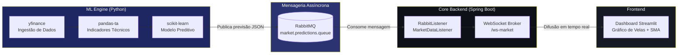

# TrendPulse AI

### Plataforma reativa de análise preditiva de mercados financeiros, orientada a eventos e alimentada por Machine Learning

TrendPulse AI combina um pipeline de Machine Learning em Python com um backend orientado a eventos em Java/Spring Boot para transformar dados de mercado em previsões acionáveis, entregues em tempo real através de WebSockets. O projeto foi desenhado como demonstração prática de arquitetura distribuída, mensageria assíncrona e orquestração de sistemas de IA em produção.

---

## Arquitetura do Sistema

O sistema está dividido em três componentes independentes, comunicando de forma assíncrona e desacoplada:

- **ML Engine & Ingestão de Dados (Python):** responsável por obter dados históricos e em tempo real via `yfinance`, calcular indicadores técnicos com `pandas-ta` (ex: Médias Móveis Simples), e gerar previsões através de modelos `scikit-learn`. Após o processamento, publica os resultados numa fila RabbitMQ.
- **Core Backend (Java / Spring Boot):** consome as previsões da fila RabbitMQ através de um `@RabbitListener`, e distribui-as instantaneamente a todos os clientes ligados via WebSocket (STOMP sobre SockJS), garantindo baixa latência e comunicação bidirecional.
- **Dashboard (Python / Streamlit):** interface visual "dark mode" que apresenta gráficos de velas interativos (Plotly), médias móveis e métricas de previsão, pensada para um contexto de trading.

Esta separação de responsabilidades permite escalar cada componente de forma independente — por exemplo, múltiplas instâncias do ML Engine podem publicar previsões para a mesma fila, enquanto o Core Backend distribui essa informação a milhares de clientes WebSocket sem acoplamento direto entre os serviços.

### Fluxo Event-Driven



---

## Tecnologias Utilizadas

| Camada | Tecnologia | Finalidade |
|---|---|---|
| Core Backend | Java 17, Spring Boot 3 | Orquestração, WebSockets, integração AMQP |
| Mensageria | RabbitMQ (Spring AMQP) | Comunicação assíncrona entre serviços |
| Comunicação Real-Time | WebSocket (STOMP/SockJS) | Difusão de previsões em baixa latência |
| ML Engine | Python 3.11, scikit-learn | Modelação preditiva de séries temporais |
| Dados de Mercado | yfinance | Ingestão de dados históricos e em tempo real |
| Indicadores Técnicos | pandas-ta | Cálculo de SMA, RSI e outros indicadores |
| Frontend | Streamlit, Plotly | Dashboard interativo em dark mode |
| Build/Dependências | Maven, pip | Gestão de dependências dos módulos |

---

## Como Executar Localmente

```bash
# 0. RabbitMQ (broker de mensageria)
docker compose up -d
# UI de gestão disponível em http://localhost:15672 (guest/guest)

# 1. Core Backend
cd core-backend
mvn spring-boot:run

# 2. ML Engine (ambiente virtual recomendado)
cd ml-engine
pip install -r requirements.txt

# 3. Dashboard
cd dashboard
pip install -r requirements.txt
streamlit run app.py
```

### Testar o fluxo ponta-a-ponta (Python → RabbitMQ → Java)

Com o RabbitMQ e o Core Backend a correr, publica uma mensagem de teste diretamente sem passar pelo dashboard:

```bash
cd ml-engine/tests
python test_rabbitmq_publish.py --symbol AAPL
```

Deverás ver nos logs do `core-backend` uma linha como:

```
INFO ... MarketDataListener : Previsão recebida do ML Engine: AAPL -> preço previsto=197.1 (confiança=0.65)
```

Isto confirma que a mensagem percorreu: `pika` (Python) → exchange `market.predictions.exchange` → queue `market.predictions.queue` → `@RabbitListener` (Java). O mesmo fluxo pode ser acionado a partir da UI do dashboard, no expander "Publicação assíncrona (RabbitMQ)".

---


