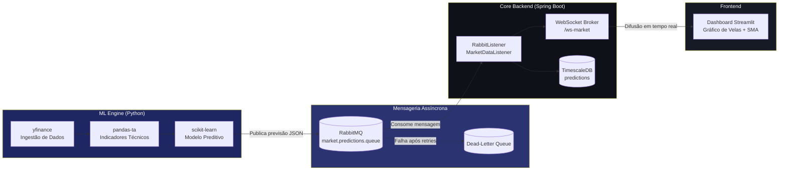
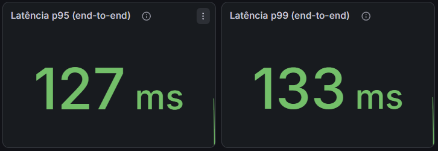

<<<<<<< Updated upstream
#  TrendPulse AI
=======
# TrendPulse AI
>>>>>>> Stashed changes

Plataforma de análise preditiva de mercados financeiros, orientada a eventos.
TrendPulse AI combina um pipeline de Machine Learning em Python com um
backend orientado a eventos em Java/Spring Boot para transformar dados de
mercado em previsões, entregues em tempo real via WebSocket. Projeto de
demonstração de arquitetura distribuída, mensageria assíncrona e
observabilidade de sistemas de IA em produção.

## Overview

O sistema está dividido em três componentes independentes, comunicando de
forma assíncrona e desacoplada:

<<<<<<< Updated upstream
##  Arquitetura do Sistema
=======
- ML Engine e Ingestão de Dados (Python): obtém dados históricos e em tempo
  real via `yfinance`, calcula indicadores técnicos com `pandas-ta`, e gera
  previsões com um modelo `scikit-learn`. Publica os resultados numa fila
  RabbitMQ.
- Core Backend (Java / Spring Boot): consome as previsões da fila RabbitMQ
  via `@RabbitListener`, persiste-as em TimescaleDB, e distribui-as a todos
  os clientes ligados via WebSocket (STOMP sobre SockJS).
- Dashboard (Python / Streamlit): gráficos de velas interativos (Plotly),
  médias móveis e métricas de previsão.
>>>>>>> Stashed changes

Esta separação permite escalar cada componente de forma independente — por
exemplo, múltiplas instâncias do ML Engine podem publicar para a mesma fila,
enquanto o Core Backend distribui essa informação a múltiplos clientes
WebSocket sem acoplamento direto entre os serviços.

Estado do desenvolvimento: as fundações (monorepo, WebSocket + RabbitMQ),
o pipeline preditivo (feature engineering, `RandomForestRegressor`),
persistência (TimescaleDB), containerização (Docker Compose), avaliação de
accuracy, API versionada e observabilidade (Micrometer + Prometheus +
Grafana) estão implementados. O que falta está descrito em Limitations.

## Architecture



### Modelo preditivo (scikit-learn)

<<<<<<< Updated upstream
##  Tecnologias Utilizadas
=======
O `ml-engine` treina um `RandomForestRegressor` para prever o retorno
percentual do dia seguinte, usando features relativas (retornos, rácios
face a médias móveis, RSI, volatilidade, volume relativo) — desenhadas para
generalizar entre ativos com escalas de preço muito diferentes (ex: AAPL
vs. BTC-USD). O artefacto treinado é guardado em
`ml-engine/models/price_predictor.joblib`.
>>>>>>> Stashed changes

O dashboard deteta automaticamente a presença deste ficheiro: se existir,
usa a previsão do modelo; se não existir, cai num fallback heurístico de
cruzamento de médias móveis SMA 20/50, indicando visualmente qual das duas
fontes gerou a previsão apresentada. A confiança apresentada para o modelo
não é um valor fixo: é derivada da variância entre as árvores da floresta
(`model.estimators_`) — se todas concordarem na previsão, a confiança sobe;
se discordarem muito, desce.

### Persistência (PostgreSQL / TimescaleDB)

Cada previsão consumida da fila RabbitMQ é gravada de forma permanente,
antes de ser difundida via WebSocket. TimescaleDB é uma extensão do
PostgreSQL especializada em séries temporais: `TimescaleDbInitializer`
converte a tabela `predictions` numa hypertable particionada
automaticamente pela coluna `generated_at`, mantendo as queries rápidas
mesmo com a tabela a crescer para milhões de linhas. Sendo 100% compatível
com o protocolo PostgreSQL, o driver JDBC e o Spring Data JPA usados são os
mesmos de um Postgres normal — se o TimescaleDB não estiver disponível, a
aplicação continua a funcionar como uma tabela relacional normal, só perde
o particionamento.

<<<<<<< Updated upstream
##  Roadmap de Desenvolvimento
=======
`PredictionHistoryController` expõe, sob `/api/v1/predictions`:
>>>>>>> Stashed changes

- `GET /{symbol}/history?page=0&size=50` — histórico paginado (Spring Data `Page<T>`)
- `GET /{symbol}/count` — contagem total
- `GET /{symbol}/accuracy` — estatísticas de accuracy (ver abaixo)

### Accuracy do modelo

<<<<<<< Updated upstream
**Fase 3 — Tempo Real e Escala**
- [x] Cliente WebSocket embutido no dashboard (STOMP/SockJS), atualização sem rerun/polling
- [x] Persistência histórica de previsões (PostgreSQL / TimescaleDB)
- [ ] Consumo de dados de mercado em streaming (near real-time)
- [ ] Autenticação e gestão de múltiplos utilizadores no dashboard

**Fase 4 — Produção**
- [x] Containerização completa (Docker Compose: RabbitMQ + TimescaleDB + Core Backend + ML Engine + Dashboard)
- [x] Testes automatizados (JUnit/Mockito no backend, pytest no ml-engine)
- [x] Observabilidade e resiliência (Actuator, Dead-Letter Queue, retry com backoff, healthchecks)
- [ ] CI/CD (GitHub Actions)

**Fase 5 — Accuracy, API e UX**
- [x] Job diário de avaliação de accuracy (`AccuracyEvaluationService`), comparando `predictedPrice` com o preço real observado
- [x] API versionada (`/api/v1/...`) com paginação real (`Page<T>` do Spring Data)
- [x] Gráfico "previsto vs. real" e métricas de accuracy no dashboard
- [x] Grid comparativo multi-ativo, gauge de confiança e anotação de previsão no candlestick
- [x] TTL de cache adaptado ao período pedido, limpeza explícita do WebSocket ao trocar de ativo

**Fase 6 — Métricas de Latência e Throughput**
- [x] Instrumentação Micrometer do pipeline (latência end-to-end + por etapa: persistência/broadcast)
- [x] Contadores de throughput e taxa de erro, tagged por símbolo/tendência
- [x] Prometheus (scraping automático) + Grafana (dashboard pré-provisionado, 8 painéis)
- [x] Testes unitários das métricas com `SimpleMeterRegistry` real

---

##  Modelo Preditivo (scikit-learn)

O `ml-engine` treina um `RandomForestRegressor` para prever o **retorno percentual do dia seguinte**, usando features relativas (retornos, rácios face a médias móveis, RSI, volatilidade, volume relativo) — desenhadas para generalizar entre ativos com escalas de preço muito diferentes (ex: AAPL vs. BTC-USD).

```bash
cd ml-engine
pip install -r requirements.txt
python train_model.py                              # treina com os 5 ativos por defeito
python train_model.py --tickers AAPL MSFT --period 1y   # personalizado
```

O artefacto treinado é guardado em `ml-engine/models/price_predictor.joblib`. O dashboard deteta automaticamente a presença deste ficheiro:

- **Modelo presente** → usa a previsão real do `RandomForestRegressor` (badge verde "🤖 Previsão gerada pelo modelo")
- **Modelo ausente** → cai automaticamente no fallback heurístico de cruzamento SMA 20/50 (badge amarelo de aviso), para que o dashboard nunca fique bloqueado

A confiança apresentada não é um valor fixo: é derivada da **variância entre as árvores da floresta** — se todas as árvores concordarem na previsão, a confiança sobe; se discordarem muito, desce. Isto dá um sinal de incerteza genuíno, em vez de um número arbitrário.

## 🗄️ Persistência (PostgreSQL / TimescaleDB)

Cada previsão consumida da fila RabbitMQ é agora gravada de forma permanente, antes de ser difundida via WebSocket. Isto resolve uma lacuna importante das fases anteriores: sem persistência, não havia forma de responder a "o que é que o modelo previu para a AAPL na semana passada?" — a informação existia só durante a difusão em tempo real.

**Porquê TimescaleDB (e não PostgreSQL simples)?** TimescaleDB é uma extensão do PostgreSQL especializada em séries temporais — converte a tabela `predictions` numa *hypertable*, particionada automaticamente pela coluna `generated_at`. Isto mantém as queries rápidas mesmo quando a tabela cresce para milhões de linhas (ex: "previsões dos últimos 7 dias" tira partido do particionamento em vez de fazer table scan completo). Como é 100% compatível com o protocolo PostgreSQL, o driver JDBC e o Spring Data JPA usados são exatamente os mesmos de um Postgres normal.

- `PredictionEntity` — entidade JPA persistida (`core-backend/.../model/PredictionEntity.java`), com campos `actualPrice`/`actualReturn` já preparados (mas por preencher) para uma futura Fase de cálculo de accuracy histórica do modelo.
- `TimescaleDbInitializer` — ativa a extensão `timescaledb` e converte `predictions` em hypertable no arranque da aplicação (o Hibernate sabe criar tabelas relacionais, mas não tem noção de extensões específicas do Postgres).
- `PredictionHistoryController` — expõe (todos sob `/api/v1/predictions`, ver "API e Accuracy" abaixo):
  - `GET /{symbol}/history?page=0&size=50` — histórico paginado (Spring Data `Page<T>`)
  - `GET /{symbol}/count` — contagem total
  - `GET /{symbol}/accuracy` — estatísticas de accuracy (ver secção seguinte)

Exemplo:
```bash
curl "http://localhost:8080/api/v1/predictions/AAPL/history?page=0&size=10"
```

##  Accuracy do Modelo e API Versionada

**Job diário de avaliação (`AccuracyEvaluationService`):** todos os dias às 22:00 (configurável via `trendpulse.accuracy.cron` / env `ACCURACY_JOB_CRON`), o Core Backend procura previsões com mais de 1 dia e sem `actualPrice` preenchido, consulta o preço real mais recente de cada símbolo (via um cliente HTTP dedicado ao endpoint público do Yahoo Finance — independente do `ml-engine`/Python) e grava `actualPrice`/`actualReturn` na previsão. Isto fecha o loop entre "o que o modelo previu" e "o que realmente aconteceu".

```bash
# Ver quantas previsões já foram avaliadas e qual a % de acerto de direção
=======
`AccuracyEvaluationService` corre diariamente (cron configurável via
`trendpulse.accuracy.cron` / env `ACCURACY_JOB_CRON`, default 22:00),
procura previsões com mais de um dia sem `actualPrice` preenchido, consulta
o preço real mais recente de cada símbolo (via um cliente HTTP dedicado ao
endpoint público do Yahoo Finance, independente do ml-engine/Python), e
grava `actualPrice`/`actualReturn`, fechando o loop entre "o que o modelo
previu" e "o que realmente aconteceu":

```bash
>>>>>>> Stashed changes
curl "http://localhost:8080/api/v1/predictions/AAPL/accuracy"
# {"symbol":"AAPL","totalEvaluated":12,"correctDirection":8,"accuracyRate":0.667,"averageConfidence":0.61}
```

### Resiliência

- Dead-Letter Queue: a queue `market.predictions.queue` está associada a
  uma dead-letter-exchange. Combinado com retry (5 tentativas, backoff
  exponencial), uma mensagem que falhe repetidamente acaba em
  `market.predictions.dlq` em vez de ser perdida ou bloquear a fila
  principal.
- Validação defensiva: `MarketDataListener` rejeita mensagens com `symbol`
  em falta ou `confidence` fora de `[0,1]`, lançando uma exceção explícita.
- Retry com backoff no dashboard: `fetch_market_data` (Python) tenta até 3
  vezes com backoff exponencial antes de desistir de obter dados do Yahoo
  Finance.
- Spring Boot Actuator (`/actuator/health`) reporta o estado agregado da
  aplicação, incluindo RabbitMQ e base de dados — usado pelos healthchecks
  do Docker Compose.

### Observabilidade (Micrometer + Prometheus + Grafana)

<<<<<<< Updated upstream
- **Dead-Letter Queue (RabbitMQ):** a queue `market.predictions.queue` está associada a uma dead-letter-exchange. Combinado com a política de retry (`spring.rabbitmq.listener.simple.retry`, 5 tentativas com backoff exponencial), uma mensagem que falhe repetidamente (JSON malformado, exceção no listener) acaba automaticamente em `market.predictions.dlq` — visível na Management UI do RabbitMQ (`http://localhost:15672`) — em vez de ser perdida ou bloquear a fila principal.
- **Validação defensiva no listener:** `MarketDataListener` rejeita mensagens com `symbol` em falta ou `confidence` fora de `[0,1]`, lançando uma exceção explícita em vez de propagar dados inválidos para os clientes WebSocket ou para a base de dados.
- **Retry com backoff no dashboard:** `fetch_market_data` (Python) tenta até 3 vezes com backoff exponencial (1s, 2s, 4s) antes de desistir de obter dados do Yahoo Finance, e mostra um botão "Tentar novamente" em vez de um stack trace cru.
- **Spring Boot Actuator:** `GET /actuator/health` reporta o estado agregado da aplicação, incluindo a ligação ao RabbitMQ e à base de dados — usado pelos `healthcheck` do Docker Compose para saberem quando o Core Backend está mesmo pronto (não só "up").

##  Métricas de Latência e Throughput (Micrometer + Prometheus + Grafana)

O pipeline de processamento de previsões (RabbitMQ → TimescaleDB → WebSocket) está instrumentado ponta-a-ponta com [Micrometer](https://micrometer.io/), expostas em `/actuator/prometheus` e visualizadas num dashboard Grafana já provisionado — sem necessidade de configuração manual.

**Métricas capturadas** (`MarketDataListener`):
=======
O pipeline (RabbitMQ → TimescaleDB → WebSocket) está instrumentado
ponta-a-ponta, exposto em `/actuator/prometheus`:
>>>>>>> Stashed changes

| Métrica | Tipo | O que mede |
|---|---|---|
| `trendpulse_prediction_total_duration_seconds` | Timer (p50/p95/p99) | Latência end-to-end: receção RabbitMQ até difusão WebSocket concluída |
| `trendpulse_prediction_persist_duration_seconds` | Timer, tagged por `symbol` | Latência isolada da escrita em TimescaleDB |
| `trendpulse_prediction_broadcast_duration_seconds` | Timer, tagged por `symbol` | Latência isolada da difusão via WebSocket |
| `trendpulse_predictions_processed_total` | Counter, tagged por `symbol`/`trend` | Previsões processadas com sucesso (com `rate()`, dá o throughput) |
| `trendpulse_predictions_failed_total` | Counter, tagged por `symbol` | Falhas de validação/processamento |
| `http_server_requests_seconds` | Timer (automático, via Actuator) | Latência de todos os endpoints REST |

Decompor a latência total em persistência vs. broadcast permite identificar
onde está o gargalo se a latência subir. O dashboard Grafana
(`monitoring/grafana/dashboards/trendpulse-latency-throughput.json`) é
carregado automaticamente no arranque, com 8 painéis: throughput agregado,
taxa de erro, latência p95/p99 end-to-end, séries temporais de p50/p95/p99,
decomposição persistência vs. broadcast, throughput por símbolo, e latência
p95 dos endpoints REST.

`MarketDataListenerTest` inclui asserções diretas sobre o `MeterRegistry`
(um `SimpleMeterRegistry` real, não mock), confirmando que os counters e
timers corretos são incrementados após cada previsão processada ou falhada.


*Latência end-to-end (RabbitMQ → TimescaleDB → WebSocket) capturada em ambiente local: p95 = 127ms, p99 = 133ms.*

### Dashboard

<<<<<<< Updated upstream
##  Testes
=======
Interface Streamlit com tema escuro próprio (fundo `#0A0E1A`, acento teal
`#2DD4BF` para alta e coral `#FB7185` para baixa), tipografia dedicada
(Space Grotesk para títulos, Inter para texto corrido, JetBrains Mono para
valores numéricos), navegação em separadores (`st.tabs`) para análise,
feed ao vivo, accuracy histórica e publicação manual, cartões de métricas
em HTML/CSS próprio em vez de `st.metric`, um gauge de confiança calibrado
ao intervalo real observado (50%-95%), e a anotação do preço previsto
diretamente sobre o gráfico de velas.
>>>>>>> Stashed changes

Cache com TTL adaptado ao período pedido (5 min para períodos curtos, 1h
para períodos longos, já que histórico "antigo" praticamente não muda), e
fecho explícito da ligação WebSocket anterior ao trocar de ativo, para
evitar ligações penduradas.

<<<<<<< Updated upstream
**ML Engine (Python) — pytest:**
```bash
cd ml-engine
pip install -r requirements.txt
pytest tests/ -v
```
`test_features.py` valida a engenharia de features com dados sintéticos (sem depender de rede/yfinance); `test_predict.py` valida a camada de inferência, incluindo o fallback gracioso quando o modelo não existe e a classificação correta de tendência (UP/DOWN/NEUTRAL).

##  Dashboard — UX, Performance e Storytelling Visual

**Redesign visual completo** — o dashboard deixou de usar o tema default do Streamlit e passou a ter identidade própria de terminal de trading:
- **Paleta:** navy quase-preto (`#0A0E1A`) em vez de cinza neutro, com dois acentos que carregam significado de domínio — teal `#2DD4BF` (alta) e coral `#FB7185` (baixa) — em vez de cores decorativas arbitrárias.
- **Tipografia:** *Space Grotesk* para títulos/UI (geométrica, técnica), *Inter* para texto corrido, *JetBrains Mono* para todos os números — preços alinhados tabularmente, como um terminal financeiro real.
- **Elemento assinatura — fita de cotações:** uma tira de preços a deslizar continuamente no topo (AAPL, BTC-USD, TSLA, MSFT), construída em CSS puro (`@keyframes`, sem JavaScript), que pausa ao passar o rato por cima.
- **Navegação em separadores:** as secções antigas empilhadas (análise, live, accuracy, publicação) passaram a viver em `st.tabs`, reduzindo a sensação de scroll infinito.
- **Cartões customizados:** métricas deixaram de usar `st.metric` (visual genérico do Streamlit) e passaram a cartões HTML/CSS próprios, com hover subtil e números monoespaçados.
- **Pill "AO VIVO"** com ponto pulsante (CSS `@keyframes`) no cabeçalho, sinalizando visualmente que os dados são dinâmicos.

**UX**
- **Grid comparativo multi-ativo:** ativa "📊 Comparar vários ativos" na sidebar para ver AAPL/BTC-USD/TSLA/MSFT lado a lado (preço, tendência, confiança), em vez de alternar um ticker de cada vez.
- **Gauge de confiança:** semicírculo colorido (vermelho → laranja → verde) ao lado das métricas principais, calibrado ao intervalo real de confiança que o modelo produz (50%-95%), não a uma escala genérica.
- **Anotação de previsão no candlestick:** o preço previsto pelo modelo aparece agora diretamente no gráfico de velas, ligado ao último candle por uma linha tracejada e uma anotação com seta — em vez de viver só num cartão de métricas separado do contexto visual.

**Performance**
- **TTL de cache adaptado ao período:** períodos curtos (3mo/6mo) usam TTL de 5 min; períodos longos (1y/2y) usam TTL de 1h, já que o histórico "antigo" praticamente não muda de um minuto para o outro.
- **Limpeza explícita do WebSocket:** ao trocar de ativo, a ligação STOMP anterior é fechada explicitamente antes de abrir a nova (registo partilhado em `window.top.__tpActiveSockets`), evitando ligações penduradas mesmo em cenários onde o browser não recicla o iframe automaticamente.

##  Como Executar Localmente
=======
## Setup
>>>>>>> Stashed changes

### Opção A — Docker Compose (recomendado)

```bash
docker compose up -d --build
docker compose --profile training run --rm ml-trainer   # treina o modelo (job único)
docker compose restart dashboard                          # apanha o modelo recém-treinado
```

Serviços:

| Serviço | URL |
|---|---|
| Dashboard (Streamlit) | http://localhost:8501 |
| Core Backend (REST/WS) | http://localhost:8080 |
| RabbitMQ Management UI | http://localhost:15672 (guest/guest) |
| TimescaleDB | localhost:5432 (trendpulse/trendpulse) |
| Prometheus | http://localhost:9090 |
| Grafana | http://localhost:3000 (admin/admin) |

`ml-trainer` corre atrás de um Docker Compose profile (`training`) e não
sobe automaticamente com `docker compose up` — é um job pontual, não um
serviço de longa duração. O modelo treinado fica num volume Docker
partilhado (`ml-models`), lido pelo `dashboard` em runtime. Para retreinar
com outros tickers/período:

```bash
docker compose --profile training run --rm ml-trainer --tickers AAPL BTC-USD --period 3y
docker compose restart dashboard
```

```bash
docker compose down          # mantém volumes (dados RabbitMQ, modelo treinado)
docker compose down -v       # remove também os volumes
```

### Opção B — Execução manual (sem Docker)

```bash
# 0. RabbitMQ + TimescaleDB
docker compose up -d rabbitmq timescaledb

# 1. Core Backend
cd core-backend
mvn spring-boot:run

# 2. ML Engine — treinar o modelo
cd ml-engine
pip install -r requirements.txt
python train_model.py

# 3. Dashboard
cd dashboard
pip install -r requirements.txt
streamlit run app.py
```

## Usage

### Treinar/retreinar o modelo

```bash
cd ml-engine
python train_model.py                                   # 5 ativos por defeito
python train_model.py --tickers AAPL MSFT --period 1y    # personalizado
```

### Testar o fluxo ponta-a-ponta (Python → RabbitMQ → Java)

Com RabbitMQ e Core Backend a correr, publica uma mensagem de teste
diretamente, sem passar pelo dashboard:

```bash
cd ml-engine/tests
python manual_rabbitmq_publish.py --symbol AAPL
```

Confirma o percurso `pika` (Python) → exchange `market.predictions.exchange`
→ queue `market.predictions.queue` → `@RabbitListener` (Java) através dos
logs do `core-backend`. O mesmo fluxo pode ser acionado a partir da UI do
dashboard, no separador de publicação.

### Ver a atualização em tempo real no browser

O separador "Previsão ao vivo" do dashboard tem um cliente STOMP/SockJS
embutido, ligado a `ws://localhost:8080/ws-market`, subscrevendo
`/topic/predictions/<symbol>`. Os valores (preço atual, previsto,
tendência, confiança) atualizam-se diretamente no DOM via JavaScript
assim que `MarketDataListener` publica no tópico — sem rerun do Streamlit.

Nota: a sidebar tem duas URLs separadas para o Core Backend, porque correm
em contextos diferentes — a URL pública (usada pelo cliente WebSocket, que
corre no browser, tipicamente `http://localhost:8080`) e a URL interna
(usada pelas chamadas REST feitas pelo próprio processo Python do
dashboard; com `docker compose`, `http://core-backend:8080`, via
`BACKEND_INTERNAL_URL`). Se aparecer o aviso de falha ao obter o histórico
de accuracy, é quase sempre a URL interna que está errada para o cenário
em causa.

### Consultar histórico de previsões

```bash
curl "http://localhost:8080/api/v1/predictions/AAPL/history?page=0&size=10"
```

### Testes

```bash
# Backend (Java) — JUnit 5 + Mockito
cd core-backend
mvn test

# ML Engine (Python) — pytest
cd ml-engine
pip install -r requirements.txt
pytest tests/ -v
```

`MarketDataListenerTest` isola a lógica de negócio (validação, persistência,
broadcast) via mocks, e corre em milissegundos sem exigir RabbitMQ nem base
de dados real; `CoreBackendApplicationTests` verifica que o contexto Spring
arranca, usando H2 em memória em vez de TimescaleDB. `test_features.py`
valida a engenharia de features com dados sintéticos (sem depender de
rede/yfinance); `test_predict.py` valida a camada de inferência, incluindo
o fallback quando o modelo não existe e a classificação de tendência
(UP/DOWN/NEUTRAL).

## Tech Stack

| Camada | Tecnologia | Finalidade |
|---|---|---|
| Core Backend | Java 17, Spring Boot 3 | Orquestração, WebSockets, integração AMQP |
| Mensageria | RabbitMQ (Spring AMQP) | Comunicação assíncrona entre serviços |
| Comunicação Real-Time | WebSocket (STOMP/SockJS) | Difusão de previsões em baixa latência |
| Persistência | PostgreSQL + TimescaleDB, Spring Data JPA | Histórico de previsões particionado por tempo |
| ML Engine | Python 3.11, scikit-learn | Modelação preditiva de séries temporais |
| Dados de Mercado | yfinance | Ingestão de dados históricos e em tempo real |
| Indicadores Técnicos | pandas-ta | Cálculo de SMA, RSI e outros indicadores |
| Frontend | Streamlit, Plotly | Dashboard interativo |
| Observabilidade | Spring Boot Actuator, Micrometer, Prometheus, Grafana | Health checks, métricas de latência/throughput, dashboards |
| Resiliência | RabbitMQ DLQ, retry com backoff (Java + Python) | Tolerância a falhas transitórias |
| Testes | JUnit 5, Mockito, pytest | Testes unitários backend e ml-engine |
| Build/Dependências | Maven, pip | Gestão de dependências dos módulos |

## Limitations

- Ingestão de dados de mercado é por pedido (via `yfinance`), não um stream
  contínuo near-real-time — item ainda por implementar do roadmap original.
- O dashboard não tem autenticação nem suporte a múltiplos utilizadores.
- Não há pipeline de CI/CD configurado (GitHub Actions) — os testes correm
  apenas localmente.
- O broker WebSocket é o *simple broker* em memória do próprio Spring
  (`registry.enableSimpleBroker`), não um broker de mensagens de produção
  com clustering — não escala horizontalmente para múltiplas instâncias do
  Core Backend sem trabalho adicional (ex: um broker relay externo).
- A confiança apresentada para as previsões do modelo é heurística (derivada
  da variância entre as árvores do `RandomForestRegressor`), não uma
  probabilidade calibrada estatisticamente.
- O fallback de previsão (cruzamento de SMA 20/50) é uma heurística simples,
  usada apenas quando o modelo treinado não está disponível — não tem a
  mesma base estatística que o modelo treinado.
- O job diário de accuracy depende de um endpoint público não-oficial do
  Yahoo Finance para obter o preço real; se esse endpoint mudar ou ficar
  indisponível, a avaliação de accuracy fica adiada até ao próximo ciclo.
- Os testes do Core Backend usam H2 em memória em vez do TimescaleDB real —
  cobrem a lógica de negócio, não o comportamento específico da extensão
  TimescaleDB (particionamento, hypertables) em condições reais.
- `TimescaleDbInitializer` falha de forma silenciosa (só regista um aviso)
  se a extensão `timescaledb` não estiver disponível — a aplicação continua
  a funcionar como PostgreSQL simples, sem o utilizador ser alertado de
  forma mais visível do que um log.
